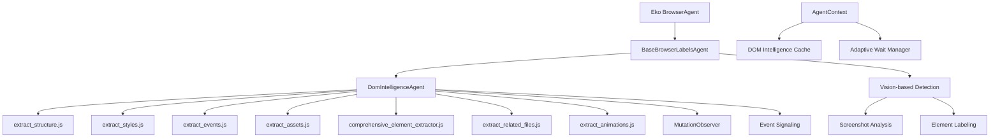
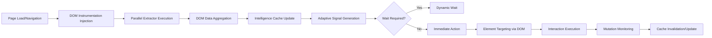
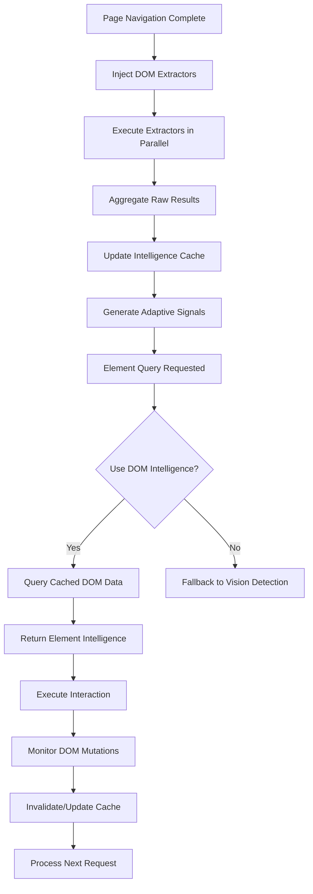
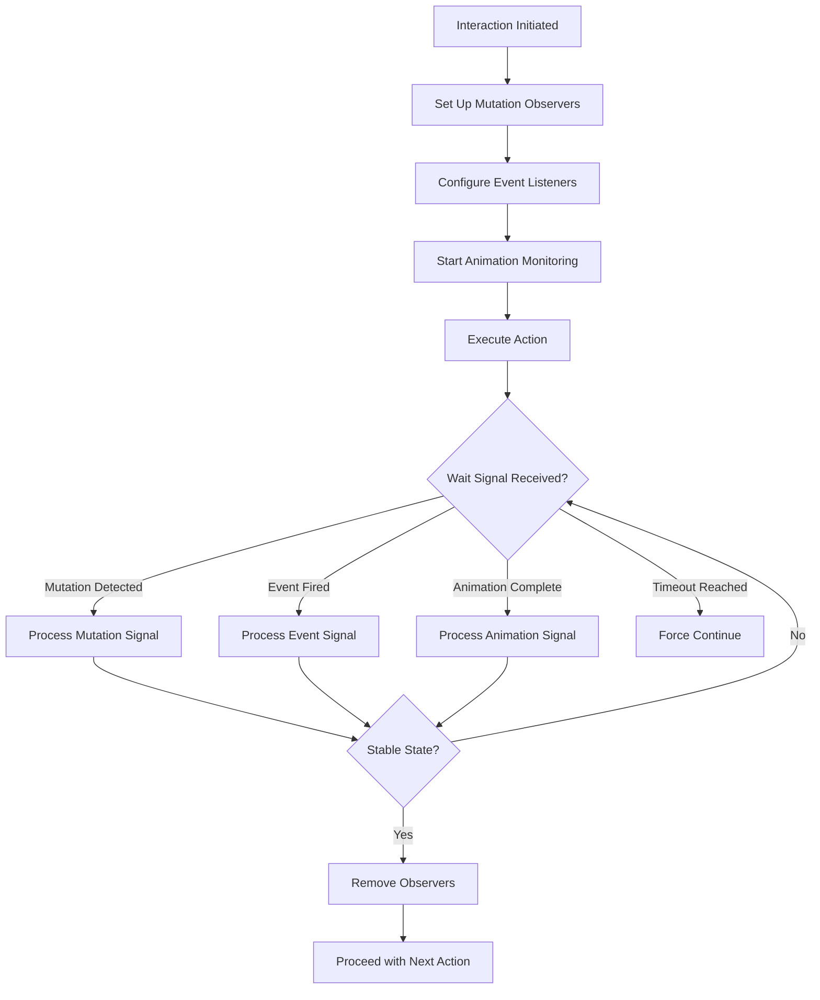

# Design Document

## Overview

This design document outlines the architecture for enhancing the Eko BrowserAgent to incorporate DOM-based intelligence through specialized JavaScript extractors. The enhancement addresses current limitations in speed, reliability, and intelligence by integrating 7 specialized DOM extractors that provide comprehensive page understanding beyond vision-only detection. The solution maintains full backward compatibility while enabling significant performance improvements through parallel processing, adaptive signaling, and direct DOM queries.

## Architecture Design

### System Architecture Diagram



### Data Flow Diagram



## Component Design

### DomIntelligenceAgent
- **Responsibilities**: Manages the lifecycle of JS extractors, coordinates parallel execution, aggregates results, and provides standardized interfaces
- **Interfaces**:
  - `injectExtractors(agentContext)`: Safely injects extractor scripts into page context
  - `runExtractorsParallel(extractorNames)`: Executes specified extractors concurrently
  - `aggregateResults(rawResults)`: Normalizes extractor outputs into consistent data structures
  - `getIntelligence(query)`: Provides cached DOM intelligence for element targeting
- **Dependencies**: Browser execution context, AgentContext for caching

### Extractor Integration
- **extract_structure.js**: Extracts basic DOM metadata (tag, id, class, attributes, dimensions, children, scroll info)
- **extract_styles.js**: Provides computed CSS styles, matching CSS rules, and pseudo-elements
- **extract_events.js**: Detects inline and framework-specific event handlers
- **extract_assets.js**: Discovers stylesheets, scripts, and modules for resource awareness
- **comprehensive_element_extractor.js**: Primary source providing HTML, styles, events, animations, and fonts
- **extract_related_files.js**: Extracts media assets (images, videos, audio, icons)
- **extract_animations.js**: Provides animation, transition, and transform data

### BaseBrowserLabelsAgent Extensions
- **domIntelligence Property**: Instance of DomIntelligenceAgent for DOM-based capabilities
- **Enhanced screenshot_and_html Method**: Integrates DOM intelligence with vision detection
- **Adaptive Wait Integration**: Replaces fixed waits with DOM mutation-based signaling
- **Element Targeting Enhancement**: Prioritizes DOM-based element identification over vision-only detection

### AgentContext Updates
- **DOM Intelligence Cache**: Stores extracted DOM data to avoid redundant queries
- **Adaptive Wait Manager**: Manages dynamic wait signals based on DOM mutations and events
- **Extractor State Tracking**: Maintains execution state and results of DOM extractors

## Data Model

### Core Data Structure Definitions

```typescript
interface BoundingRect {
  x: number;
  y: number;
  width: number;
  height: number;
  top: number;
  left: number;
  bottom: number;
  right: number;
}

interface DomElementIntelligence {
  elementId: string; // stable identifier for serialization
  tagName: string;
  id?: string;
  className?: string;
  attributes: Record<string, string>;
  boundingRect: BoundingRect; // JSON-serializable replacement for DOMRect
  computedStyles: Record<string, string>;
  eventHandlers: EventHandler[];
  children: string[]; // child elementIds to avoid object cycles
  scrollInfo: ScrollInfo;
  animations: AnimationData[];
  relatedAssets: AssetReference[];
}

interface EventHandler {
  type: string;
  hasHandler: boolean; // avoid storing function source for security/size
  framework?: 'react' | 'vue' | 'angular' | 'jquery';
  isInline: boolean;
}

interface ScrollInfo {
  scrollTop: number;
  scrollLeft: number;
  scrollHeight: number;
  scrollWidth: number;
  clientHeight: number;
  clientWidth: number;
}

interface AnimationData {
  name: string;
  duration: number;
  delay: number;
  timingFunction: string;
  properties: string[];
}

interface AssetReference {
  type: 'image' | 'video' | 'audio' | 'icon' | 'stylesheet' | 'script';
  url: string;
  elementId?: string; // reference by id to avoid embedding full object
}

interface MutationSummary {
  type: 'attributes' | 'childList' | 'characterData';
  targetId: string;
  attributeName?: string;
  addedNodes?: string[]; // elementIds
  removedNodes?: string[]; // elementIds
}

interface DomIntelligenceCache {
  elements: Record<string, DomElementIntelligence>; // JSON-safe instead of Map
  timestamp: number;
  pageUrl: string;
  mutations: MutationSummary[]; // JSON-safe subset of MutationRecord
}

interface AdaptiveWaitSignal {
  type: 'mutation' | 'event' | 'animation' | 'load';
  elementId?: string;
  timestamp: number;
  data: unknown;
}
```

## Business Process

### Process 1: DOM Intelligence Gathering and Element Targeting



### Process 2: Adaptive Wait Signal Management



## Security and CSP Strategy

- Use isolated worlds or equivalent browser contexts for script evaluation to avoid inline script CSP violations.
- Prefer script execution via DevTools/Playwright protocols with nonces/hashes when needed; avoid injecting raw inline code.
- Detect CSP restrictions at runtime; if evaluation in page context is blocked, fall back to protocol domains (DOM/CSS/Performance) or vision-only mode.
- Detect cross-origin/sandboxed iframes; do not attempt direct DOM access; report limitation and provide best-effort via frame bounding boxes or vision.
- Traverse open shadow roots; treat closed shadow roots as opaque and use vision-based fallback.
- Limit extracted data to metadata required for targeting and metrics; avoid capturing large text content or PII.

## Error Handling Strategy

### Fallback Mechanisms
- **DOM Extraction Failure**: Automatically fall back to vision-based detection when DOM queries fail due to cross-origin restrictions or unavailable contexts
- **Extractor Injection Failure**: Graceful degradation with logging and vision-only mode activation
- **Parallel Execution Errors**: Individual extractor failures don't block others; partial results are aggregated
- **Cache Corruption**: Automatic cache invalidation and re-extraction on detection of stale or corrupted data

### Error Recovery
- **Mutation Observer Failures**: Fallback to polling-based change detection
- **Event Handler Detection Issues**: Continue with available intelligence data
- **Asset Discovery Errors**: Non-critical; logged but don't prevent other extractors
- **Animation Data Extraction**: Optional enhancement; absence doesn't break core functionality

### Logging and Monitoring
- **Error Categorization**: DOM failures, network issues, script injection problems
- **Performance Metrics**: Track extraction times, cache hit rates, fallback frequency
- **Debug Information**: Detailed logs for troubleshooting extractor-specific issues

### Backward Compatibility
- **Vision Fallback**: All existing functionality preserved as default behavior
- **Configuration Flags**: Opt-in DOM intelligence features with no impact on existing workflows
- **Performance Overhead**: Minimal additional overhead (<50ms) when DOM features disabled
- **API Preservation**: All existing tool interfaces and response formats maintained