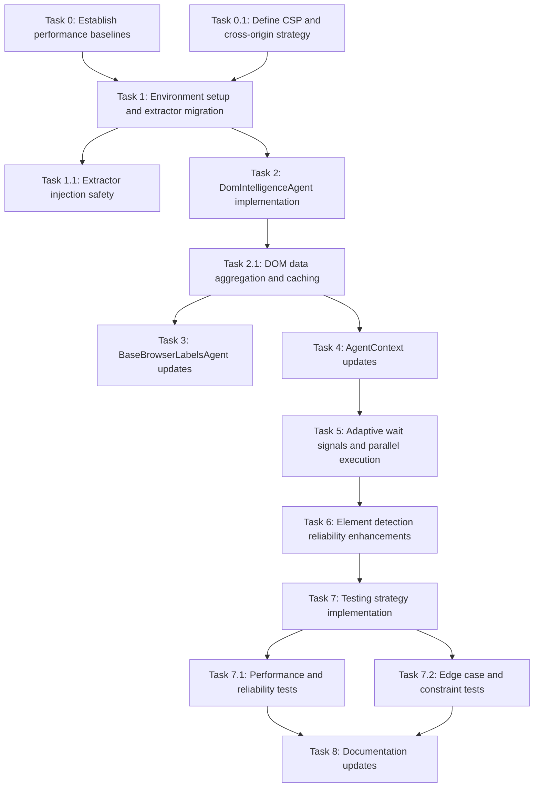

# Implementation Plan

- [ ] 0. Establish performance baselines
  - Measure current screenshot analysis cycle count and timing
  - Benchmark current element identification accuracy rate
  - Document current wait time patterns and sequential processing duration
  - Create instrumentation for ongoing performance comparison
  - _Requirements: 2.1, 2.2, 2.3, 2.5_

- [ ] 0.1 Define CSP and cross-origin strategy
  - Analyze target page CSP policies and injection constraints
  - Design isolated world/utility script approach for CSP compliance
  - Document cross-origin iframe handling limitations and fallbacks
  - Evaluate CDP/Playwright protocol alternatives for restricted contexts
  - _Requirements: 4.3, 4.5_

- [ ] 1. Set up environment and migrate JS extractors
  - Create directory structure for DOM intelligence components and extractors
  - Migrate the 7 JS extractor files (extract_structure.js, extract_styles.js, extract_events.js, extract_assets.js, comprehensive_element_extractor.js, extract_related_files.js, extract_animations.js) to the project
  - Ensure extractors are compatible with the browser execution context
  - _Requirements: 1.1, 1.2, 1.3, 1.4, 1.5, 1.6, 1.7_

- [ ] 1.1 Implement extractor injection safety mechanisms
  - Add Content Security Policy compliant script injection methods
  - Implement error handling for cross-origin restriction failures
  - Create fallback mechanisms for extractor injection failures
  - _Requirements: 4.3, 4.5_

- [ ] 2. Implement DomIntelligenceAgent class
  - Create DomIntelligenceAgent class with standardized interfaces (injectExtractors, runExtractorsParallel, aggregateResults, getIntelligence)
  - Implement parallel execution logic for running multiple extractors simultaneously
  - Add result aggregation and normalization into consistent data structures
  - Integrate with AgentContext for caching and state management
  - _Requirements: 4.1, 2.2, 4.4_

- [ ] 2.1 Implement DOM data aggregation and caching
  - Create DomIntelligenceCache structure and management methods
  - Implement cache invalidation on DOM mutations
  - Add intelligence query methods for element targeting
  - _Requirements: 2.4, 3.1_

- [ ] 3. Update BaseBrowserLabelsAgent
  - Add domIntelligence property as an instance of DomIntelligenceAgent
  - Modify screenshot_and_html method to integrate DOM intelligence with vision detection
  - Implement element targeting enhancements prioritizing DOM-based identification
  - Ensure backward compatibility with existing vision-only functionality
  - _Requirements: 4.2, 5.1, 5.2_

- [ ] 4. Update AgentContext
  - Add DOM Intelligence Cache storage and retrieval methods
  - Implement Adaptive Wait Manager with dynamic wait signals
  - Add extractor state tracking for execution and results
  - Integrate mutation observers and event signaling
  - _Requirements: 2.3, 3.1_

- [ ] 5. Implement adaptive wait signals and parallel execution
  - Create AdaptiveWaitSignal interface and processing logic
  - Implement mutation observer setup and monitoring
  - Add event listener configuration for dynamic signaling
  - Replace fixed wait times with adaptive 0.5-2 second responses
  - _Requirements: 2.3, 3.1, 3.2, 3.3_

- [ ] 6. Enhance element detection reliability
  - Implement form validation awareness extraction from DOM attributes
  - Add layout shift detection using bounding rectangle monitoring
  - Enhance off-viewport element detection with DOM queries and scroll detection
  - Implement framework-specific handling for React/Vue/Angular components
  - _Requirements: 3.2, 3.3, 3.4, 3.5_

- [ ] 7. Implement testing strategy
  - Write unit tests for each of the 7 JS extractors
  - Create unit tests for DomIntelligenceAgent methods
  - Implement integration tests for agent functionality with parallel execution
  - Add tests for adaptive wait signals and cache management
  - _Requirements: 2.5_

- [ ] 7.1 Add performance and reliability tests
  - Create tests to verify 60% reduction in screenshot analysis cycles
  - Implement tests for 40% reduction in sequential processing time
  - Add tests for 95% element identification accuracy
  - Create tests for fallback to vision-based detection
  - _Requirements: 2.1, 2.2, 2.5, 4.5_

- [ ] 7.2 Add edge case and constraint tests
  - Test cross-origin iframe handling and fallback behavior
  - Test shadow DOM element extraction and targeting
  - Test strict CSP page scenarios (script-src 'self', no inline)
  - Test mutation-heavy SPA scenarios (virtual lists, frequent updates)
  - Test framework-specific detection (React delegated events, Vue reactivity, Angular zones)
  - _Requirements: 3.5, 4.5_

- [ ] 8. Update documentation
  - Add configuration options documentation for DOM intelligence features
  - Update API documentation for new DomIntelligenceAgent interfaces
  - Document migration path and backward compatibility details
  - Include performance improvement metrics in documentation
  - _Requirements: 5.3, 5.5_

## Tasks Dependency Diagram

