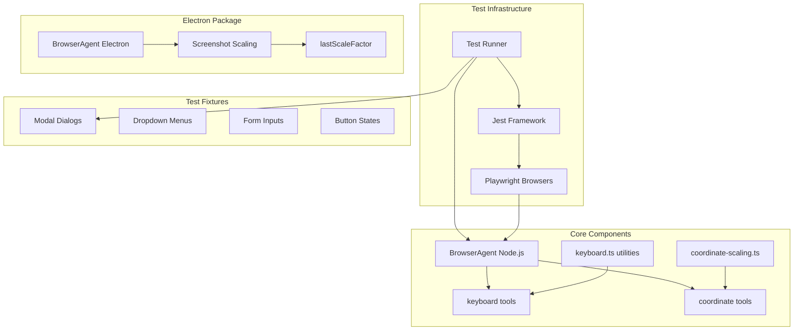
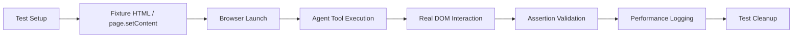

# Design Document

## Overview

This design document outlines the implementation of integration tests for keyboard mapping and coordinate tools within the XSky AI Agent framework. The tests **extend existing test suites** to add real browser validation, UI pattern fixtures, combined workflows, and performance baselines.

Key objectives:
- Extend existing mocked tests with real browser integration tests
- Establish test fixtures for common UI patterns (modals, dropdowns, forms)
- Add combined keyboard + coordinate workflow tests
- Create performance baseline measurements
- Document limitations (DPR, shadow DOM coordinates, Electron tools)

## Existing Test Infrastructure

| Test File | Type | Lines | Purpose |
|-----------|------|-------|---------|
| `packages/ai-agent-nodejs/test/browser-coordinate-tools.test.ts` | Unit (mocked) | 455 | Coordinate tool logic with mock Playwright |
| `packages/ai-agent-nodejs/test/browser-keyboard-integration.test.ts` | Integration | 125 | Real browser keyboard tests |
| `packages/ai-agent-core/test/common/coordinate-scaling.test.ts` | Unit | ~90 | Scale factor math |
| `packages/ai-agent-electron/test/screenshot-scaling.test.ts` | Unit | ~137 | Electron screenshot scaling |

## Architecture Design

### System Architecture Diagram


### Data Flow Diagram


## Component Design

### Component A: Extended Integration Test Suite
- **Location**: Extend `packages/ai-agent-nodejs/test/browser-keyboard-integration.test.ts`
- **Responsibilities**: Add real browser tests for coordinate tools, combined workflows
- **Pattern**: Follow existing `INTEGRATION:` test naming convention
- **Dependencies**: Jest, Playwright (chromium), BrowserAgent

### Component B: Test Fixtures
- **Location**: `packages/ai-agent-nodejs/test/fixtures/` (new directory)
- **Responsibilities**: Provide HTML snippets for testing UI patterns
- **Method**: Use `page.setContent()` (matching existing pattern) or static HTML files
- **Patterns**: Modal overlays, dropdown menus, form inputs, buttons

### Component C: Performance Baseline
- **Location**: New describe block in integration tests
- **Responsibilities**: Measure and log operation latency
- **Method**: `performance.now()` before/after tool execution
- **Output**: Console log baseline metrics for future regression detection

### Component D: Electron Screenshot Tests
- **Location**: Extend `packages/ai-agent-electron/test/screenshot-scaling.test.ts`
- **Responsibilities**: Validate scale factor calculations
- **Scope**: Screenshot scaling only (coordinate/keyboard tools not implemented in Electron)

## Data Model

### Test Result Structure
```typescript
interface IntegrationTestResult {
  testName: string;
  browser: 'chromium';  // Current focus; Firefox/WebKit optional
  duration: number;
  success: boolean;
  error?: string;
  performance?: {
    operationLatencyMs: number;
  };
}
```

### Test Fixture Pattern
```typescript
// Using page.setContent() like existing tests
const fixtureHtml = `
  <html>
    <body>
      <button id="test-btn">Click Me</button>
      <input id="test-input" type="text" />
    </body>
  </html>
`;
await page.setContent(fixtureHtml);
```

## Implementation Scope

### In Scope
| Area | Implementation |
|------|----------------|
| Keyboard integration tests | Extend existing real browser tests |
| Coordinate tool tests | Add real browser tests (currently mocked only) |
| Combined workflows | New tests for keyboard + coordinate sequences |
| UI fixtures | Modal, dropdown, form, button patterns |
| Performance baselines | Logging-only; thresholds set later |
| Viewport scaling | Extend existing scale factor tests |

### Out of Scope (Not Implemented in Codebase)
| Area | Reason |
|------|--------|
| DPR handling | `scaleCoordinates()` doesn't account for device pixel ratio |
| Shadow DOM coordinate input | DOM extraction handles shadow; coordinate tools don't |
| Nested iframe coordinate input | DOM extraction has iframe offset handling; coordinate tools don't |
| Electron coordinate tools | `ai-agent-electron/src/browser.ts` doesn't implement them |
| Electron keyboard tools | Not implemented in Electron package |
| International layout testing | Requires OS-level keyboard switching |

## Error Handling Strategy

- **Invalid Key Combinations**: Throw "requires at least one action key" (implemented in `keyboard.ts:329-334`)
- **Unknown Keys**: Throw "Unknown key" with supported keys hint (implemented in `keyboard.ts:284-288`)
- **Scale Factor Edge Cases**: Return original coordinates when scaleFactor ≤ 0 or undefined (implemented in `coordinate-scaling.ts:29-31`)
- **Test Isolation**: Use `beforeEach` to reset page state; `afterAll` for browser cleanup

## Testing Strategy

### Test Classification
- **Unit Tests** (Existing): Mocked Playwright for fast tool logic validation
- **Integration Tests** (Extended): Real Chromium browser for end-to-end validation
- **Performance Tests** (New): Baseline measurements with logging

### Test Naming Convention
Follow existing pattern:
```typescript
it("INTEGRATION: should [action] [expected result]", async () => {
  // ...
});
```

### Fixture Strategy
Use inline `page.setContent()` for simple fixtures (matching `browser-keyboard-integration.test.ts` pattern):
```typescript
await page.setContent(`
  <html><body>
    <div id="modal" style="position:fixed; top:100px; left:100px;">Modal</div>
  </body></html>
`);
```

### Performance Baseline Methodology
```typescript
it("PERF: should measure keyboard combination latency", async () => {
  const start = performance.now();
  await keyCombination(page, ["Control", "a"]);
  const duration = performance.now() - start;
  console.log(`[PERF] keyboard_combination latency: ${duration.toFixed(2)}ms`);
  expect(duration).toBeLessThan(1000); // Sanity check only
});
```
