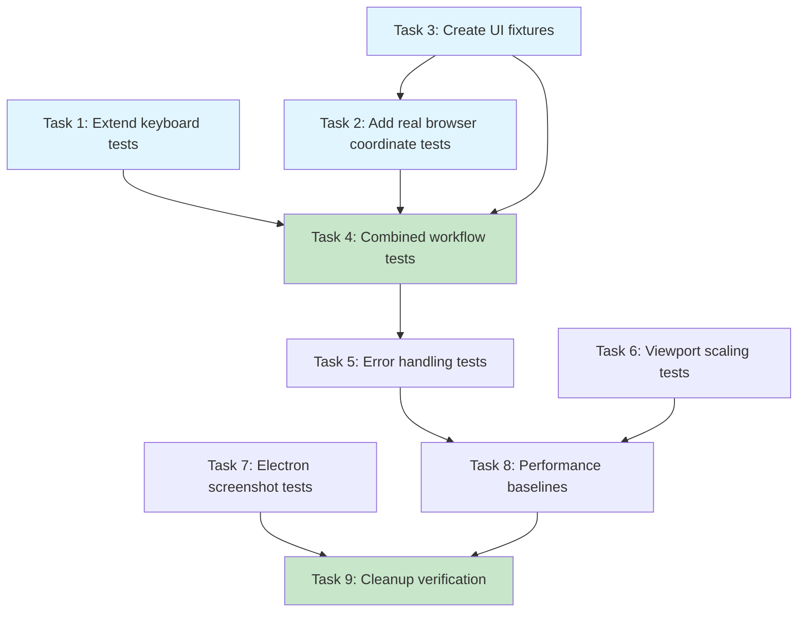

# Implementation Plan

## Existing Tests to Extend

| File | Current State | Action |
|------|---------------|--------|
| `packages/ai-agent-nodejs/test/browser-keyboard-integration.test.ts` | 125 lines, real browser | Extend with more keyboard tests |
| `packages/ai-agent-nodejs/test/browser-coordinate-tools.test.ts` | 455 lines, mocked | Add real browser integration section |
| `packages/ai-agent-core/test/common/coordinate-scaling.test.ts` | Scale math tests | Extend edge cases |
| `packages/ai-agent-electron/test/screenshot-scaling.test.ts` | Screenshot scaling | Extend with more resolutions |

## Tasks

- [x] 1. Extend keyboard integration tests
  - Add modifier combination tests (Ctrl+C, Ctrl+V, Ctrl+Shift+A) to `browser-keyboard-integration.test.ts`
  - Add Tab key navigation tests
  - Add Escape key tests
  - Add international key code mapping validation (verify `IntlYen`, `Lang1`, etc. exist in map)
  - _Requirements: 1.1, 1.2, 1.3, 1.4_
  - _Extends: `packages/ai-agent-nodejs/test/browser-keyboard-integration.test.ts`_

- [x] 2. Add real browser coordinate tool tests
  - Create new `describe("Real Browser Coordinate Operations")` block in `browser-coordinate-tools.test.ts`
  - Add click operation tests with `chromium.launch()` and actual DOM elements
  - Add hover operation tests verifying mouse:over events fire
  - Add drag operation tests with event sequence validation
  - Add scroll tests verifying viewport position changes
  - _Requirements: 2.1, 2.2, 2.3, 2.4_
  - _Extends: `packages/ai-agent-nodejs/test/browser-coordinate-tools.test.ts`_

- [x] 3. Create UI pattern test fixtures
  - Create `packages/ai-agent-nodejs/test/fixtures/` directory
  - Add modal dialog fixture HTML
  - Add dropdown menu fixture HTML
  - Add form input fixture HTML
  - Document fixtures can be used via `page.setContent()` or file read
  - _Requirements: 8.1, 8.2, 8.3, 8.4_

- [x] 4. Implement combined keyboard + coordinate workflow tests
  - Add test for click-then-type workflow
  - Add test for Ctrl+A select-all followed by typing
  - Add test for Shift+Click multi-select simulation
  - Add test for drag with Shift modifier held
  - _Requirements: 4.1, 4.2, 4.3, 4.4_

- [x] 5. Add error handling validation tests
  - Add tests verifying "requires at least one action key" error (already exists, verify coverage)
  - Add tests verifying "Unknown key" error messages (already exists, verify coverage)
  - Add tests for scale factor edge cases (0, negative, undefined)
  - _Requirements: 5.1, 5.2, 5.3, 5.4_

- [x] 6. Add viewport scaling edge case tests
  - Extend `coordinate-scaling.test.ts` with more resolution combinations
  - Add tests for very small viewports
  - Add tests for very large viewports (8K)
  - Verify rounding behavior for fractional coordinates
  - _Requirements: 3.1, 3.2, 3.4_
  - _Extends: `packages/ai-agent-core/test/common/coordinate-scaling.test.ts`_

- [x] 7. Extend Electron screenshot scaling tests
  - Add more resolution test cases to `screenshot-scaling.test.ts`
  - Add portrait orientation tests
  - Add edge cases for exactly-at-boundary dimensions
  - Document that Electron coordinate/keyboard tools are NOT implemented
  - _Requirements: 7.1, 7.2, 7.3_
  - _Extends: `packages/ai-agent-electron/test/screenshot-scaling.test.ts`_

- [x] 8. Add performance baseline tests
  - Create new `describe("PERF: Performance Baselines")` block
  - Add coordinate scaling latency measurement
  - Add keyboard combination latency measurement
  - Add coordinate tool execution latency measurement
  - Log results to console for baseline establishment
  - _Requirements: 6.1, 6.2, 6.3_

- [x] 9. Verify test cleanup and isolation
  - Ensure all tests use proper `beforeEach`/`afterEach` cleanup
  - Verify browser instances are closed in `afterAll`
  - Run full test suite to confirm no cross-test interference
  - _Requirements: 5.5_

## Tasks Dependency Diagram

## Out of Scope Tasks (Blocked on Feature Implementation)

These tasks from the original spec are **removed** because they require implementing features that don't exist:

| Original Task | Blocked By |
|---------------|------------|
| Electron coordinate tool tests | Electron BrowserAgent doesn't implement `buildCoordinateTools()` |
| Electron keyboard tool tests | Electron BrowserAgent doesn't implement `buildKeyboardTools()` |
| DPR variation tests | `scaleCoordinates()` doesn't handle DPR |
| Nested iframe coordinate tests | Coordinate tools don't transform through frames |
| Shadow DOM coordinate tests | Coordinate tools don't pierce shadow boundaries |
| International layout tests | Requires OS-level keyboard switching |

## Success Criteria

- [x] All existing tests continue to pass
- [x] New integration tests pass with real Chromium browser
- [x] Performance baselines are logged to console
- [x] No test isolation issues (parallel test runs succeed)
- [x] Documentation clearly states what is out of scope
