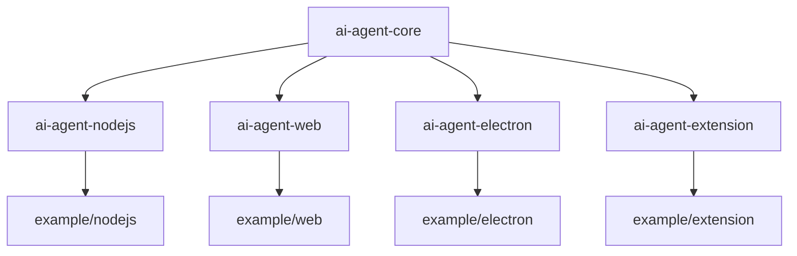

# Architecture: Monorepo Structure

XSky is a monorepo that separates the core agent framework from environment-specific implementations.

## Package Overview

## Packages

### `packages/ai-agent-core`
The heart of the framework. Contains no environment-specific dependencies (like Node `fs` or DOM APIs) unless abstracted.

- **Responsibility**: Orchestration, Planning, Dialogue, LLM abstraction, Tool definitions, Hooks.
- **Key Exports**: `XSky`, `Agent`, `Context`, `XSkyDialogue`.

### `packages/ai-agent-nodejs`
Runtime for Node.js environments.

- **Dependencies**: `playwright`, `chromium-bidi`
- **Agents**:
  - `BrowserAgent`: Uses Playwright to control a real browser instance.
  - `FileAgent`: Uses Node `fs` for file operations.

### `packages/ai-agent-web`
Runtime for browser environments (SPAs).

- **Dependencies**: `html2canvas`
- **Agents**:
  - `BrowserAgent`: Controls the *current* browser tab via DOM APIs. Screenshots via html2canvas.
  - No FileAgent (browser sandbox limitations).

### `packages/ai-agent-electron`
Runtime for Electron apps.

- **Dependencies**: `electron`
- **Agents**:
  - `ElectronAgent`: Bridges main/renderer processes.
  - Can use Node.js capabilities in Main process.

### `packages/ai-agent-extension`
Runtime for Chrome Extensions.

- **Dependencies**: `@types/chrome`
- **Agents**:
  - `ExtensionAgent`: Uses `chrome.tabs`, `chrome.scripting` APIs.

## Build System

We use **pnpm** workspaces and **Rollup** for building.

- **Build All**: `pnpm build` (runs `pnpm -r build`)
- **Test All**: `pnpm test` (runs `pnpm -r test`)
- **Clean**: `pnpm clean`

## Data Flow

1. **User Input** (Prompt) → **Runtime** (e.g. Node)
2. **Runtime** passes prompt to **Core (XSky)**
3. **XSky** uses **LLM** to generate **Workflow XML**
4. **XSky** executes Workflow:
   - Calls **Agent** (defined in Runtime)
   - Agent calls **Tools** (defined in Runtime or Core)
   - Agent returns result to **XSky**
5. **XSky** returns final output to **Runtime**
